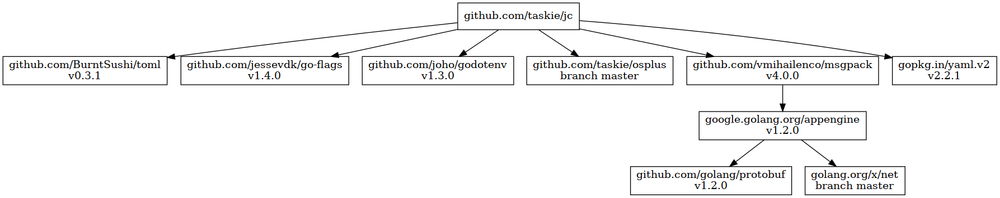

# jc

convert JSON-like formats

## Install

```sh
go install github.com/taskie/jc/cmd/jc
```

## Usage

### Convert

```sh
jc -t yaml <foo.json >foo.yaml
jc -t toml <foo.json >foo.toml
jc -t msgpack <foo.json >foo.msgpack
```

#### Input File (foo.json)

```json
{"message":[{"hello":true},{"world":42}]}
```

#### Output File (foo.yaml)

```yaml
message:
- hello: true
- world: 42
```

#### Output File (foo.toml)

```toml
[[message]]
  hello = true

[[message]]
  world = 42.0
```

#### Output File (foo.msgpack)

```sh
xxd foo.msgpack
```

```
00000000: 81a7 6d65 7373 6167 6592 81a5 6865 6c6c  ..message...hell
00000010: 6fc3 81a5 776f 726c 64cb 4045 0000 0000  o...world.@E....
00000020: 0000                                     ..
```

### Convert (Reverse)

```sh
jc -f yaml <foo.yaml >foo.json
jc -f toml <foo.toml >foo.json
jc -f msgpack <foo.msgpack >foo.json
```

## Dependency



## License

Apache License 2.0
