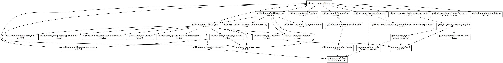

# jc

convert between JSON-like formats


## Install

```sh
go install -u github.com/taskie/jc/cmd/jc
```

## Usage

### Convert

```sh
jc foo.json foo.yaml
jc foo.yaml foo.toml
jc foo.toml foo.msgpack
jc foo.msgpack foo.json
```

or

```sh
jc -t yaml <foo.json >foo.yaml
jc -f yaml -t toml <foo.yaml >foo.toml
jc -f toml -t msgpack <foo.toml >foo.msgpack
jc -f msgpack <foo.msgpack >foo.json
```

#### Input File (foo.json)

```json
{"message":[{"hello":true},{"world":42}]}
```

#### Output File (foo.yaml)

```yaml
message:
- hello: true
- world: 42
```

#### Output File (foo.toml)

```toml
[[message]]
  hello = true

[[message]]
  world = 42
```

#### Output File (foo.msgpack)

```sh
xxd foo.msgpack
```

```
00000000: 81a7 6d65 7373 6167 6592 81a5 6865 6c6c  ..message...hell
00000010: 6fc3 81a5 776f 726c 64d3 0000 0000 0000  o...world.......
00000020: 002a                                     .*
```

## Dependency



## License

Apache License 2.0
